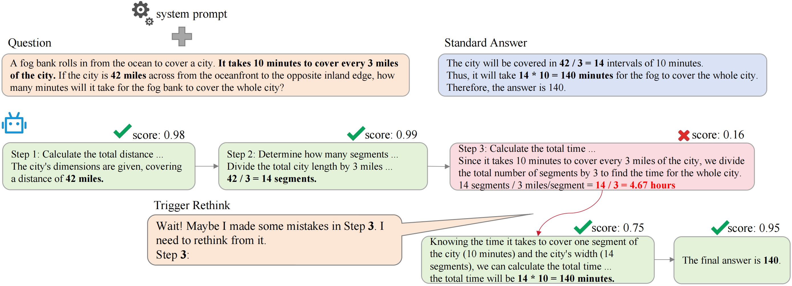

# AR-Sampling
Python implementation of Adaptive Rectification Sampling (AR-Sampling).

To demonstrate that large language models (LLMs) can rectify errors at a more fine-grained level, we propose AR-Sampling, which can guide the LLMs to self-correction at the appropriate step. AR-Sampling leverages a process-supervised reward model (PRM) as a verifier and constructed trigger sentences to guide the model in adaptive step-level rethinking.

Here is an example:



## Environment
To run the code in this project, first, create a Python virtual environment using e.g. conda:
```
conda create -n arsampling python=3.11 && conda activate arsampling
```
Then, use the requirement list to install dependencies:

```
pip install -r requirements.txt
```

## Usage

An example for usage is provided in `./scripts`.

You can modify the config or parameters in the scripts as needed. They have the same function in parameter assignment.

The core parameters are provided as follows.

```yaml
model_path: "meta-llama/Llama-3.2-1B-Instruct" 
prm_path: "RLHFlow/Llama3.1-8B-PRM-Deepseek-Data" 
gpu_memory_utilization: 0.4 
n: 16 
p: 0.3 
max_rethink: 1 
dataset_name: "HuggingFaceH4/MATH-500" 
dataset_split: "test" 
output_dir: "outputs/math500/ar_bon" 
```

- model_path: model_path for proposer model
- prm_path: model_path for verifier model (PRM)
- gpu_memory_utilization: the proportion of GPU memory usage for the proposer model, and the remaining is for the verifier.
- n: $N$ for scaling
- p: threshold $p$ in paper
- max_rethink: parameter $m$ in paper
- dataset_name: dataset name for test
- dataset_split: dataset split for test
- output_dir: the results output directory

Tips: For models not in Llama3 family, we recommend setting the `custom_chat_template: null`.

## Acknowledgement

This repository is build upon the [Huggingface-Search-and-Learn](https://github.com/huggingface/search-and-learn) repositories. Thanks for their excellent work!